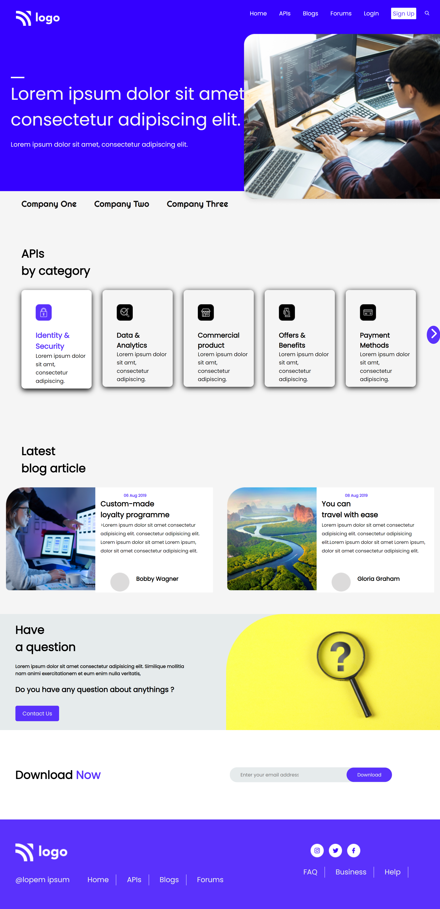

# Developer Landing Page Design

 Hello, My name is __Pratik Dhande__
I created this website using Html and Css. It's my 9th project given as an assignment in **_Full Stack Web Dev Bootcamp  Live Class_**. 

## Live link

 # Skills.

 >  ## 

# Things that i learned
- __flexbox__
- __designing good looking cards__
- __linking images__
- __footer design__
- __use of icons__
- __Html__

# Time taken to finish project

- ## `12 hr` 